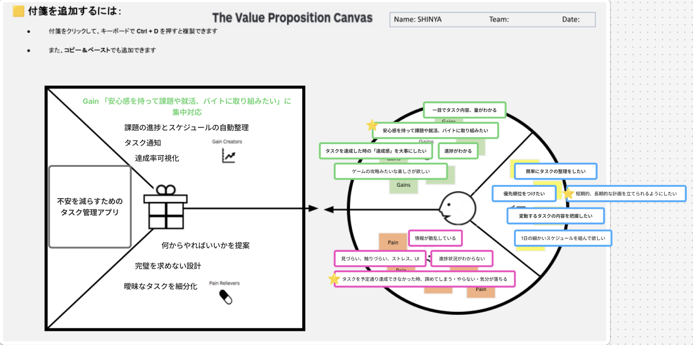

# VPC v1 - meio4309

> 「**自分や周りの人を顧客に設定**」したVPC。13週後の自分が欲しいもの・身近な人のために作りたいものを設計する。
> v1 でいい。完璧を目指さない。第6回でアップデート(v2)します。

---

## 1. 解決したい困りごとを 1つ 選ぶ

> [`bug-list.md`](./bug-list.md) の20個から、**「自分が一番これを解決したい!」と思うもの** を1つ選んでください。
> 1つに絞れなければ、複数候補を書いてOK(後で絞り込みます)。

**選んだ困りごと**:

短期・長期の計画が立てられず、何から手をつけていいか分からず不安になる（バグリスト13, 20など）

---

## 2. その解決策のアイデアを書く

> 選んだ困りごとに対する「**こうだったらいいのに**」を1つ書く。
> 現実性は気にせず、自由に発想。

**解決のアイデア**:

「不安を減らす」ことに特化したタスク管理アプリ。完璧を求めず、曖昧なタスクを細分化して、今何をすべきかを提案してくれる。

---

## 3. VPC本体

> 上で選んだ「困りごと」と「解決のアイデア」を起点に、6要素を埋めていきます。

### 🟦 Customer Profile(顧客=自分自身)

#### Jobs(やりたいこと・動詞で書く)

- 簡単にタスクの整理をしたい
- 優先順位をつけたい
- 短期的、長期的な計画を立てられるようにしたい ★
- 変動するタスクの内容を把握したい
- 1日の細かいスケジュールを組んでほしい

#### Pains(困っていること)

- 情報が散乱している
- 見づらい、触りづらい、ストレスを感じるUI
- 進捗状況がわからない
- タスクを予定通り達成できなかった時、諦めてしまう・やらない・気分が落ちる

#### Gains(得たい未来・状態)

- 一目でタスク内容、量がわかる
- 安心感を持って課題や就職、バイトに取り組みたい
- 進捗がわかる
- タスクを達成した時の「達成感」を大事にしたい
- ゲームの攻略みたいな楽しさが欲しい

---

### 🟧 Value Map(あなたが作るもの)

#### Products & Services

- 不安を減らすためのタスク管理アプリ

#### Pain Relievers

- 何からやればいいかを提案
- 完璧を求めない設計
- 曖昧なタスクを細分化

#### Gain Creators

- 「安心感を持って課題や就活、バイトに取り組みたい」という思いへの集中対応
- 課題の進捗とスケジュールの自動整理
- タスク通知
- 達成率の可視化

---

## 4. Fit確認(整合チェック)

| Pains/Gains | ↔ | Pain Relievers / Gain Creators | チェック |
|---|---|---|---|
| 何から手をつけていいか分からない | ↔ | 何からやればいいかを提案 | ✓ |
| 予定通りいかないと挫折する | ↔ | 完璧を求めない設計 | ✓ |
| タスクが曖昧で進まない | ↔ | 曖昧なタスクを細分化 | ✓ |
| 安心感を持って取り組みたい | ↔ | 安心感への集中対応・自動整理 | ✓ |
| 達成感を感じたい | ↔ | 達成率の可視化 | ✓ |

> 整合しないものは「自分が作りたいだけ」のプロダクトになりがち。
> 迷ったら AI大学講師に壁打ち。
